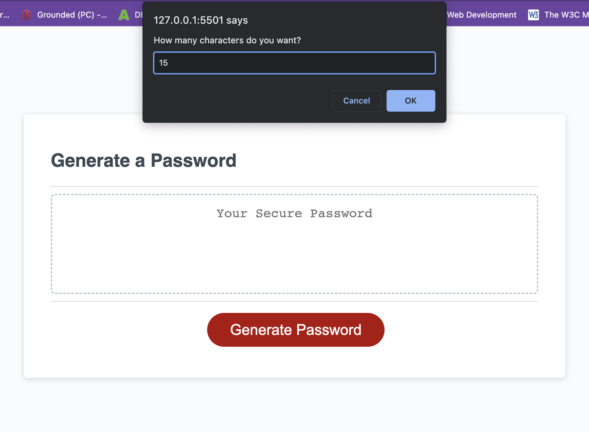
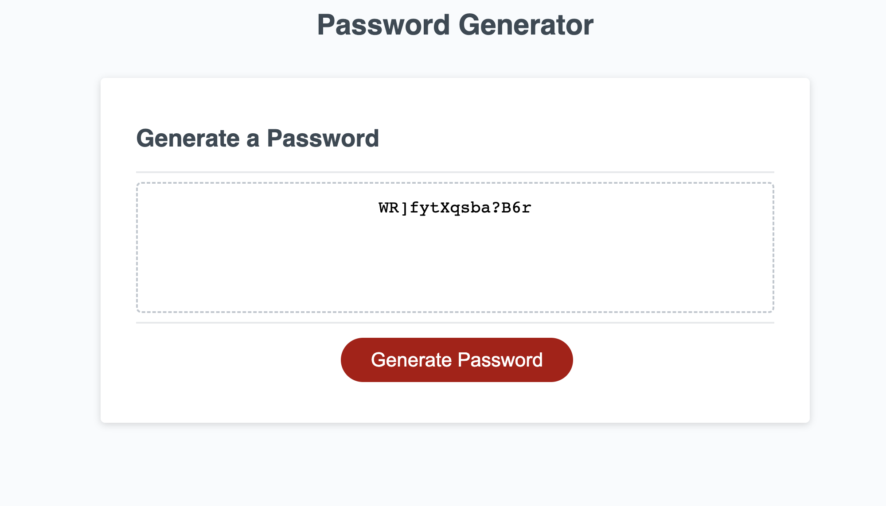

# Random Password Generator

## Description

In order to produce a random sequence of characters based on user input, this project gathers various sets of arrays holding various types of characters and concatenates their values.
This project's main objective is to use many arrays combined into a single random collection of data while adhering to best coding standards such as "Don't repeat yourself."
In creating this project, I became acquainted for the first time with DOM elements, array concatenation, and random value generation.

## Table of Contents 

- [Usage](#usage)
- [License](#license)

## Installation

Although there is no need for installation, the user must open the CONSOLE in their preferred IDE or browser in order to view the project.

## Usage
Application prompting user to enter a number of characters through an windo alert
    

Output being displayed on HTML textarea based on user's options.
    

## License

Copyright <2022> <Victor Biscio>

Permission is hereby granted, free of charge, to any person obtaining a copy of this software and associated documentation files (the "Software"), to deal in the Software without restriction, including without limitation the rights to use, copy, modify, merge, publish, distribute, sublicense, and/or sell copies of the Software, and to permit persons to whom the Software is furnished to do so, subject to the following conditions:

The above copyright notice and this permission notice shall be included in all copies or substantial portions of the Software.

THE SOFTWARE IS PROVIDED "AS IS", WITHOUT WARRANTY OF ANY KIND, EXPRESS OR IMPLIED, INCLUDING BUT NOT LIMITED TO THE WARRANTIES OF MERCHANTABILITY, FITNESS FOR A PARTICULAR PURPOSE AND NONINFRINGEMENT. IN NO EVENT SHALL THE AUTHORS OR COPYRIGHT HOLDERS BE LIABLE FOR ANY CLAIM, DAMAGES OR OTHER LIABILITY, WHETHER IN AN ACTION OF CONTRACT, TORT OR OTHERWISE, ARISING FROM, OUT OF OR IN CONNECTION WITH THE SOFTWARE OR THE USE OR OTHER DEALINGS IN THE SOFTWARE.

## Badges

## Tests

Please use the link below to easily access the application through your web browser.
[Deployed Application](https://reinkaoss.github.io/Random_Password_Generator/)
